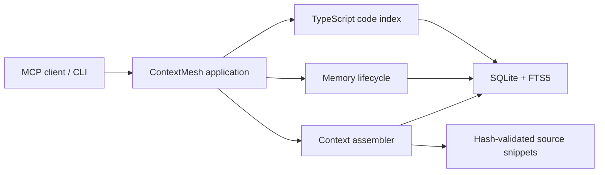
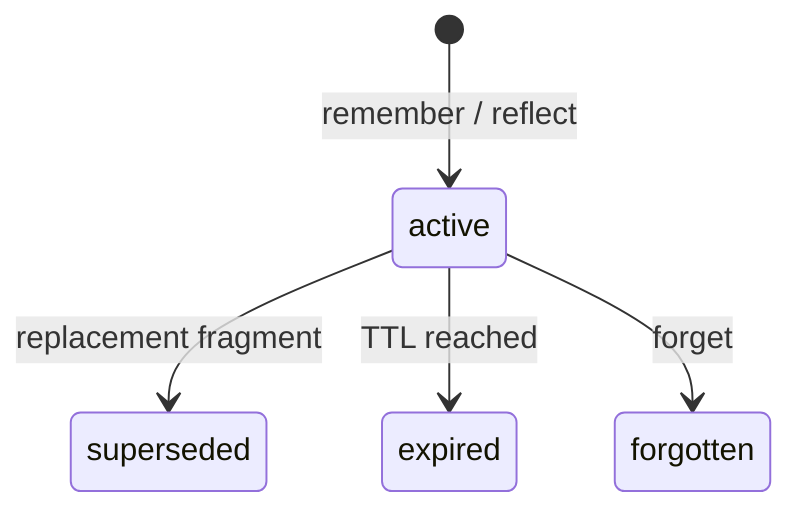

# Architecture

ContextMesh is a single-workspace, local-first MCP process. The stdio transport calls application services, which coordinate code intelligence, memory lifecycle, context assembly, and a SQLite storage boundary. It has no LLM, telemetry, embedding service, or runtime network client.

## Code generations

The scanner hashes supported TypeScript and JavaScript files after applying built-in secret/build exclusions, `.gitignore`, and `.contextmeshignore`. Symlinks and files larger than 2 MiB are skipped. When `tsconfig.json` or `jsconfig.json` exists, TypeScript's configured `fileNames` intersected with scanner policy is the project scope; a synthetic NodeNext project uses every scanner result otherwise. Sorted file names, effective compiler options, the resolved config/extends chain, and the root `package.json` are hashed so configuration-only changes cannot produce a false no-op.

Parsing and TypeChecker analysis happen before the write transaction. On commit, files, nodes, edges, unresolved evidence, FTS rows, stale memory locators, the index run, and `current_generation` transition atomically. A failed run never changes the active generation, remains persisted across restarts, and retries use a new monotonically increasing run generation. Successful, partial, and verified no-op runs form a separate success fence; a no-op advances that fence without changing the active graph generation.

Startup and strict mode hash every scoped file. Fast mode compares effective configuration, the configured path set, size, and modification time, and hashes only metadata-changed candidates. This detects normal additions, deletions, and edits without imposing full repository I/O on every query; a same-size edit with a deliberately restored modification time is a documented fast-mode blind spot. Snippet bytes are always verified independently.

Code-facing requests capture the active graph generation and success fence, read graph data in one serialized SQLite snapshot, and recheck generation, fence, and durable stale state before returning. A changed generation retries once; a second change returns the internally consistent second snapshot with `INDEX_STALE`. Index preparation does not hold the freshness mutex, so the last committed generation remains available while a new graph is built.

Incremental runs calculate the reverse dependency closure of changed and deleted files from existing cross-file edges. Only that closure is relationship-resolved again. Added files, compiler configuration changes, declaration-file changes, and full runs use a complete relationship pass. The final graph is still replaced in one transaction, favoring consistency over partial visibility.

## Memory lifecycle

Memory fragments are workspace-scoped and typed as `fact`, `decision`, `error`, `preference`, `procedure`, `relation`, or `episode`.

Active fragments are exactly deduplicated, while correction creates a new row linked through `supersedes_id`. Recall updates access metadata and writes an audit event. Reflect stores a session episode and up to 50 client-supplied learnings in one transaction. Memory-to-code links retain a stable local key and locator snapshot; after a rename, unique declaration-hash or symbol-locator matches are relinked with reduced confidence and an audit event.

All recalled/context memory objects include `untrusted: true` and assertion status. ContextMesh never interprets a memory as an instruction.

## Context selection

`get_context` ranks direct symbols, anchor memories, lexical code matches, code-linked memories, one-hop graph neighbors, related memories, and remaining memory matches. Snippets are read only after rejecting a final symlink, resolving the real path inside the workspace, reading one file-descriptor Buffer with stable identity checks, and matching its SHA-256 hash; the returned slice comes from that same Buffer. Candidates, provenance, relationships, warnings, query text, and envelope fields are admitted only while the requested estimated token budget remains. Access metadata and audit events for selected memories commit only for the final request attempt before the response is returned.
