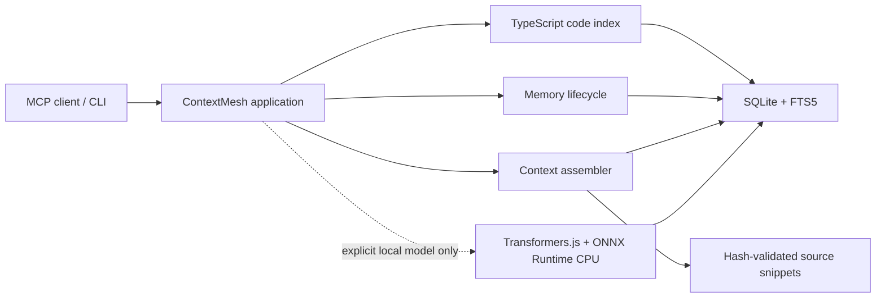
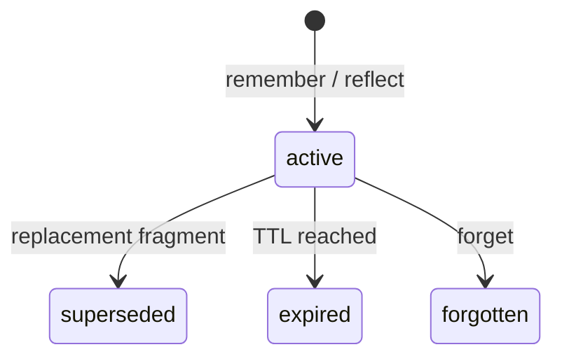

# Architecture

ContextMesh is a single-workspace, local-first MCP process. The stdio transport calls application services, which coordinate code intelligence, memory lifecycle, context assembly, optional local embeddings, and a SQLite storage boundary. It has no LLM, telemetry, remote embedding service, or runtime network client.

## Code generations

The scanner hashes supported TypeScript and JavaScript files after applying built-in secret/build exclusions, `.gitignore`, and `.contextmeshignore`. Symlinks and files larger than 2 MiB are skipped. When `tsconfig.json` or `jsconfig.json` exists, TypeScript's configured `fileNames` intersected with scanner policy is the project scope; a synthetic NodeNext project uses every scanner result otherwise. Sorted file names, effective compiler options, the resolved config/extends chain, and the root `package.json` are hashed so configuration-only changes cannot produce a false no-op.

Parsing and TypeChecker analysis happen before the write transaction. On commit, files, nodes, edges, unresolved evidence, FTS rows, stale memory locators, the index run, and `current_generation` transition atomically. A failed run never changes the active generation, remains persisted across restarts, and retries use a new monotonically increasing run generation. Successful, partial, and verified no-op runs form a separate success fence; a no-op advances that fence without changing the active graph generation.

Startup and strict mode hash every scoped file. Fast mode compares effective configuration, the configured path set, size, and modification time, and hashes only metadata-changed candidates. This detects normal additions, deletions, and edits without imposing full repository I/O on every query; a same-size edit with a deliberately restored modification time is a documented fast-mode blind spot. Snippet bytes are always verified independently.

Code-facing requests capture the active graph generation and success fence, read graph data in one serialized SQLite snapshot, and recheck generation, fence, and durable stale state before returning. A changed generation retries once; a second change returns the internally consistent second snapshot with `INDEX_STALE`. Index preparation does not hold the freshness mutex, so the last committed generation remains available while a new graph is built.

Incremental runs calculate the reverse dependency closure of changed and deleted files from existing cross-file edges. Only that closure is relationship-resolved again. Added files, compiler configuration changes, declaration-file changes, and full runs use a complete relationship pass. The final graph is still replaced in one transaction, favoring consistency over partial visibility.

## Semantic lifecycle

Semantic retrieval exists only when `ContextMeshAppOptions.semantic.modelPath` or CLI `--semantic-model` is supplied. The approved manifest is compiled into the application; its canonical JSON SHA-256 is the `model_key`. The local manifest, all seven required files, the canonical ONNX path, and every SHA-256 must match before the runtime is usable. The Node adapter dynamically imports `@huggingface/transformers@4.2.0` and `onnxruntime-node@1.24.3`, disables remote models and caches, requests only the CPU execution provider, and passes intra-op 4, inter-op 1, and sequential execution. Sequential mode records effective inter-op threads as `not_applicable`; settings without observable runtime getters remain `not_observable`.

The shared pipeline is generation-fenced and reference counted. A failed instance retires immediately for new work but is disposed only after its active users release it; replacement is single-flight and late results from an older generation cannot overwrite the new state. Query-only failures use a short in-process cooldown and do not mutate durable plane state. `ContextMeshApp.close()` rejects new work, waits for active references, and awaits asynchronous pipeline disposal.

Migration 004 stores semantic source hashes, the approved model registration, per-plane state, and `f32le-v1` Float32 BLOBs. Migration 005 adds structured failure/retry state and the database-backed reconciliation claim/lease. Canonical passages are NFC-normalized and hashed. BLOB decoding rejects wrong dimensions or byte order, non-finite values, zero vectors, and vectors outside the L2 normalization tolerance. Missing, stale, mismatched, or corrupt rows are `data_repairable`: they are excluded immediately, leave valid rows reusable, and reconcile per entity without runtime backoff.

The process-local workspace writer mutex covers code change detection, passage embedding, and the final graph/semantic transaction. Unchanged ID plus source hash vectors are restamped for the new graph generation; stale generations and changed or deleted entities are pruned atomically. A semantic failure never rolls back an otherwise valid graph/FTS commit.

Memory writes use a two-transaction CAS. The durable fragment commits first, embedding runs without a SQLite transaction, and the vector transaction then rechecks active state, SQLite-DB-time expiry, source hash, model key, and semantic eligibility revision. Bulk reconciliation performs the same checks at final commit and removes a vector if its memory expired while inference was running. A failed CAS discards the result without changing the vector table or revision. Forget, supersession, and expiry writes remove vectors and update state in their own transaction.

Reconciliation is single-writer across processes. A DB-time lease, heartbeat, completed-attempt fence, retry generation, and current model/generation-or-revision/count/failure fingerprint form the claim. The candidate token is created and revalidated inside the claiming transaction; losing a race rolls back retry and claim counters. A new graph generation or memory eligibility revision immediately supersedes an old claim, and final commits recheck both state and lease ownership. Material failures stay latched until file identity changes, while session/inference failures retry at 30 seconds, 2 minutes, then 10 minutes. Bounded inference batches refresh the heartbeat.

Each plane hydrates a contiguous `Float32Array` cache keyed by workspace, model, graph generation or memory revision. Large file-backed caches are packed in a short-lived read-only helper process so the application retains one matrix buffer rather than transient SQLite BLOB allocations. Readers compare the durable key on every request. Memory candidates additionally receive a live active/expiry/source-hash mask, so wall-clock expiry cannot leak from a warm cache even when no revision changed. Exact scan is capped at 50,000 eligible entities per plane.

## Memory lifecycle

Memory fragments are workspace-scoped and typed as `fact`, `decision`, `error`, `preference`, `procedure`, `relation`, or `episode`.

Active fragments are exactly deduplicated, while correction creates a new row linked through `supersedes_id`. Recall updates access metadata and writes an audit event. Reflect stores a session episode and up to 50 client-supplied learnings in one transaction. Memory-to-code links retain a stable local key and locator snapshot; after a rename, unique declaration-hash or symbol-locator matches are relinked with reduced confidence and an audit event.

All recalled/context memory objects include `untrusted: true` and assertion status. ContextMesh never interprets a memory as an instruction.

## Context selection

`get_context` ranks direct symbols, anchor memories, lexical and semantic matches, code-linked memories, one-hop graph neighbors, related memories, and remaining memory matches in one code-plus-memory MMR pass. Exact/direct/anchor candidates remain pinned but participate in later redundancy calculations. Other sources use weighted reciprocal-rank fusion (`k=60`, lexical/semantic weight 1.0, graph weight 0.75) followed by deterministic MMR (`0.75 relevance - 0.25 redundancy`). Public scores remain quantized to `1e-6`; an internal `1e-5` rank bucket and canonical ID break near-score ties consistently across supported OSes. Same-model vector pairs use normalized cosine; mixed/vectorless pairs use `redundancyTextVersion=1` Jaccard with defined short-text behavior. Cross-plane representatives are conditional soft reservations. Final packing removes vectorless normalized near duplicates.

Snippets are read only after rejecting a final symlink, resolving the real path inside the workspace, reading one file-descriptor Buffer with stable identity checks, and matching its SHA-256 hash; the returned slice comes from that same Buffer. Candidates, provenance, relationships, warnings, query text, and envelope fields are admitted only while the requested estimated token budget remains. Access metadata and audit events for selected memories commit only for the final request attempt before the response is returned.
